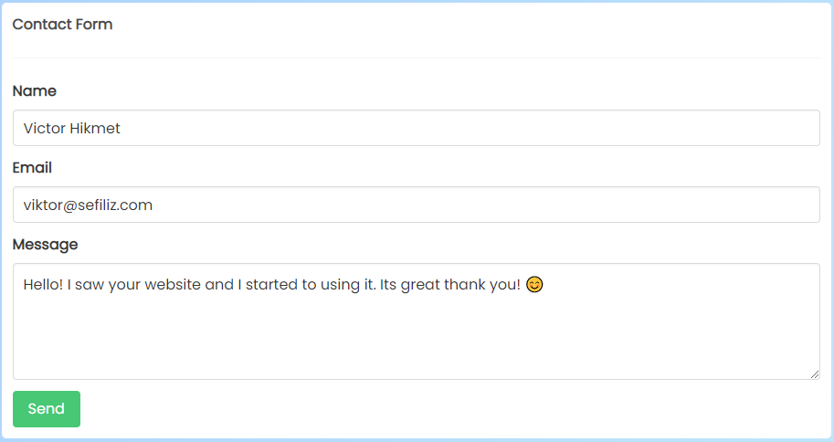
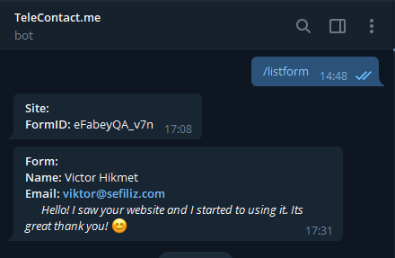

# Telecontact.me - API of your Contact page 👋

<p align="center">
  <a href="https://telecontact.me">
    
  </a>
</p>
<h3 align="center">TeleContact.me is a contact form solution for your websites.</h3>
<p align="center"> The best free solution for static web pages.</p>
<br />

[](https://telecontact.me)
[](https://telecontact.me)

---

Telecontact.me works integrated with telegram if you have a telegram account. You will instantly get notification from your website visitors. It allows you to create free urls for your domains. You can start using telecontact.me with our [_Telegram Bot_](https://telegram.me/telecontactformbot) or for extra features like saving messages or sending a notifications to your mail address, you can [_Sign Up_](https://www.telecontact.me/signup) here.

## Contact Form Example

- Create your hash_id for your domain.
- Copy example form below and replace {HASH_ID} with your one.
- Handle submit event with how ever you want.

```html
<form action="https://telecontact.me/form/{HASH_ID}" method="POST">
  <label>
    Name:
    <input type="text" name="name" />
  </label>
  <label>
    Email:
    <input type="email" name="replyto" />
  </label>
  <label>
    Message:
    <textarea name="message"></textarea>
  </label>
  <input type="submit" value="Send" />
</form>
```

### Example Form



### Instant Notification


